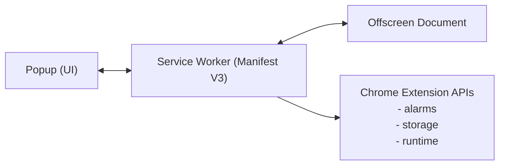

# 🔊 SpeakerKeep

Prevent your soundbar, Bluetooth speakers, and audio devices from auto-standby with ultrasonic keep-alive signals.

---

## ☕ Support Development

**If this extension helps you, consider buying me a coffee:**

[](https://www.paypal.com/paypalme/curlyman72)

---

## 📖 Table of Contents

- [Problem](#-problem)
- [Solution](#-solution)
- [Features](#-features)
- [Installation](#-installation)
- [Usage](#-usage)
- [Configuration](#-configuration)
- [Troubleshooting](#-troubleshooting)
- [Technical Details](#-technical-details)
- [Privacy](#-privacy)
- [Contributing](#-contributing)
- [License](#-license)
- [Contact](#-contact)

---

## 🎯 Problem

Modern soundbars and Bluetooth speakers include aggressive power-saving features that automatically put the device into standby mode after 15–20 minutes of "silence." This is problematic when:

- Watching movies with quiet dialogue scenes
- Listening to ambient music or white noise
- Using your computer for work with intermittent audio
- Playing games with silent exploration segments

The result: Your audio cuts out unexpectedly, requiring you to manually wake your speaker with a remote or button press.

---

## 💡 Solution

SpeakerKeep generates inaudible ultrasonic tones (default: 20 kHz) at regular intervals to trick your speakers into thinking audio is constantly playing. This prevents the auto-standby timer from reaching its threshold.

### Why 20 kHz?

- **Above human hearing range** (adult hearing typically tops out at 15–17 kHz)
- **Passes through most audio chains** including Bluetooth, optical, and HDMI
- **Typically inaudible to pets** at normal playback volumes
- **Energy efficient** — short bursts every few minutes use minimal CPU and battery

---

## ✨ Features

| Feature | Description |
|---------|-------------|
| **6 Frequency Options** | 20 kHz (recommended), 19 kHz, 1 kHz, 100 Hz, 50 Hz, 30 Hz |
| **Adjustable Interval** | 1–15 minutes between keep-alive signals |
| **Burst Duration** | 50 ms – 1000 ms tone length |
| **Test Mode** | Audible 1 kHz tone to verify speaker connectivity |
| **Background Operation** | Runs even when popup is closed |
| **Persistent State** | Survives browser restarts |
| **Visual Countdown** | Real-time timer showing next ping |
| **Heartbeat Keep-Alive** | Prevents Chrome from killing the service worker |
| **Zero Dependencies** | Self-contained, no external audio files |

---

## 🚀 Installation

### From Source (Developer Mode)

1. **Clone this repository**

```bash
git clone https://github.com/curlyman72/SpeakerKeep.git
```

2. **Open Chrome Extensions page**

- Navigate to `chrome://extensions/`
- Enable **Developer mode** (top-right toggle)

3. **Load unpacked extension**

- Click **Load unpacked**
- Select the extension folder

4. **Pin the extension** (optional)

- Click the puzzle icon in the Chrome toolbar
- Click the pin next to **SpeakerKeep**

---

### From Chrome Web Store

*Coming soon*

---

## 🎮 Usage

### Quick Start

1. Click the **SpeakerKeep** icon in your Chrome toolbar  
2. Select your preferred **frequency** (20 kHz recommended)  
3. Adjust **interval** and **duration** if needed  
4. Click **Start Keep-Alive**  
5. Close the popup — it runs in the background  

### Test Your Setup

Before relying on the keep-alive:

1. Select **1 kHz (Test)**  
2. Click **Test Signal** — you should hear a beep  
3. If you hear it, your speaker is receiving the signal  
4. Switch back to **20 kHz (Stealth)** and start  

### Interface Overview

| Element | Description |
|---------|-------------|
| **Status Dot** | Green pulsing = active, Red = inactive |
| **Countdown** | Time until next keep-alive signal |
| **Visualizer** | Animated bars when tone is playing |
| **Stats** | Current frequency, duration, and interval |

---

## ⚙️ Configuration

### Frequency Strategy

| Frequency | Use Case |
|-----------|----------|
| **20 kHz** | Default. Inaudible to most humans. |
| **19 kHz** | If 20 kHz is filtered by your audio chain |
| **1 kHz** | Test only (audible verification) |
| **100 Hz** | Sub-bass emphasis |
| **50 Hz** | Mid-bass (may be audible on large speakers) |
| **30 Hz** | Deep low-end (often filtered by small speakers) |

### Recommended Settings

| Scenario | Frequency | Interval | Duration |
|----------|-----------|----------|----------|
| General use | 20 kHz | 4 min | 200 ms |
| Aggressive standby | 20 kHz | 2 min | 300 ms |
| Bluetooth speakers | 20 kHz | 3 min | 200 ms |
| Soundbars (optical) | 20 kHz | 4 min | 200 ms |
| Testing | 1 kHz | 1 min | 500 ms |

---

## 🔧 Troubleshooting

### Extension stops working after a while

- Ensure Chrome is updated
- Avoid excessive clearing of browser data
- Verify extension is allowed to run in the background

### Timer shows "NaN" or resets

- Close and reopen the popup
- Toggle the extension off and on
- Check the browser console for errors

### No sound during test

- Verify speaker is connected and powered on
- Check system volume
- Try a different frequency

### 20 kHz doesn't prevent standby

- Try **19 kHz**
- Try **100 Hz**
- Increase duration to 500–1000 ms

### "Extension may have been corrupted"

- Go to `chrome://extensions/`
- Click **Repair**
- Or reload the extension

---

## 🔬 Technical Details

### Architecture



### How It Works

1. Service Worker maintains state and schedules alarms using `chrome.alarms`
2. Heartbeat every 20 seconds prevents termination
3. Offscreen Document handles Web Audio API playback (Manifest V3 requirement)
4. `OscillatorNode` generates sine wave tones
5. State persists via `chrome.storage`

### Browser Compatibility

| Browser | Support |
|---------|---------|
| Chrome 109+ | ✅ |
| Edge 109+ | ✅ |
| Opera 95+ | ✅ |
| Brave 1.47+ | ✅ |
| Firefox | ❌ |
| Safari | ❌ |

---

## 🔒 Privacy

SpeakerKeep:

- Does **not** collect data  
- Does **not** connect to external servers  
- Does **not** track browsing  
- Does **not** modify web pages  
- Runs entirely locally  

---

## 🤝 Contributing

Contributions welcome!

### Ideas

- [ ] Custom frequencies  
- [ ] Speaker response visualizer  
- [ ] Auto-detect optimal frequency  
- [ ] Scheduled operation  
- [ ] Multiple speaker profiles  

### Development Setup

```bash
git clone https://github.com/curlyman72/SpeakerKeep.git
```

Then load via `chrome://extensions/` → **Developer Mode** → **Load unpacked**

---

## 📜 License

MIT License — see [LICENSE](LICENSE)

Copyright (c) 2026 Jerry Lee

---

## 📧 Contact

- Issues: https://github.com/curlyman72/SpeakerKeep/issues  
- Email: jerry@raptorlabs.com  
- PayPal: https://paypal.me/curlyman72  

---

**Enjoy uninterrupted audio. 🔊**

